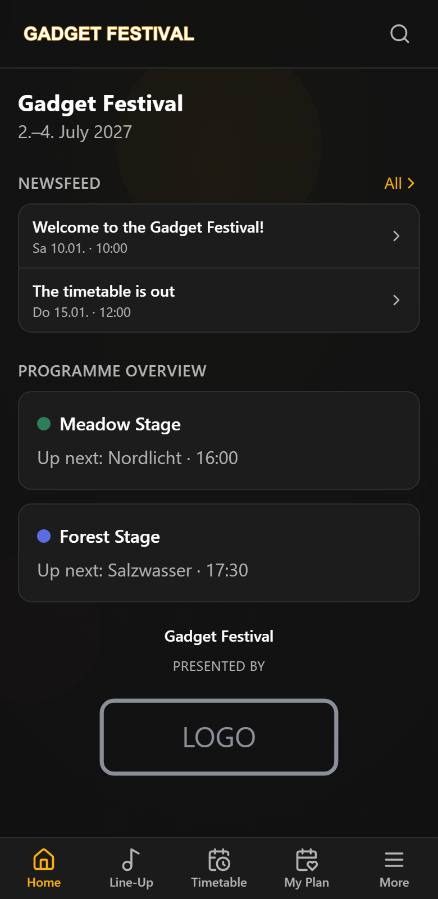
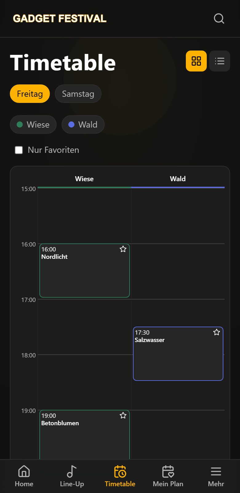
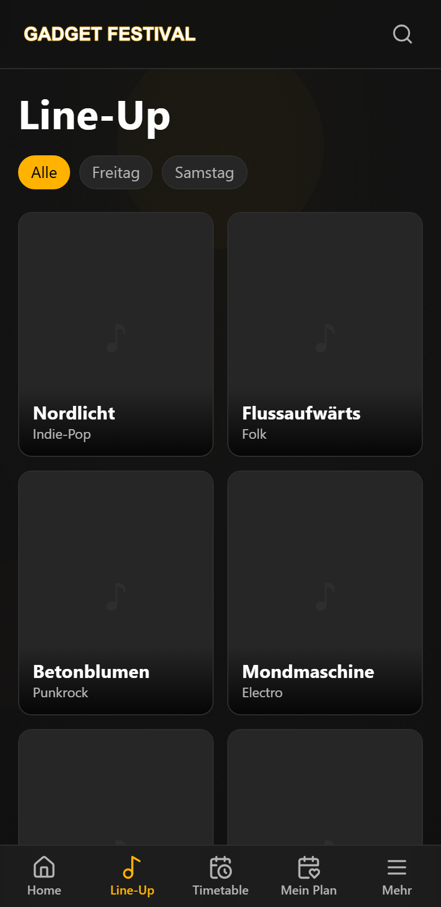
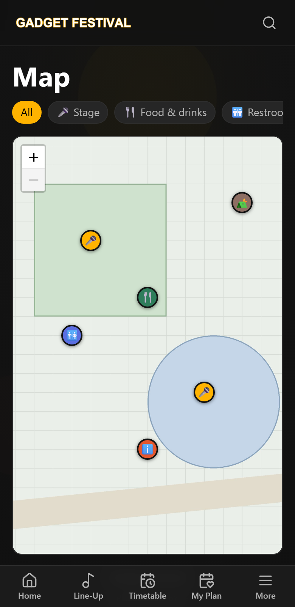
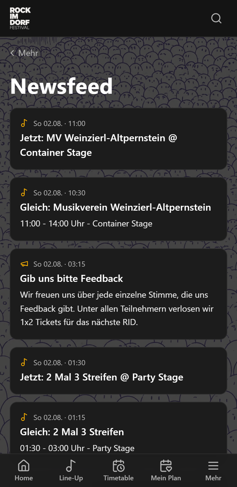
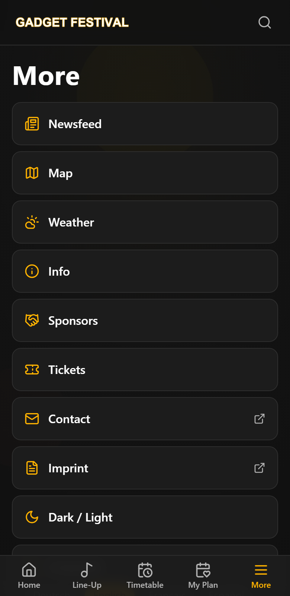

# Festivadget

**🇬🇧 [English version](README.md)**

Installierbare, offline-fähige **Progressive Web App** als Besucher-Begleiter für
**mehrtägige Events** – Line-Up, Timetable, persönlicher Plan, Karte, News und
Push-Benachrichtigungen in einer App, ohne App-Store.

Kernprinzip: **fully static**. Im Betrieb ist die App rein statisch (jeder Webspace
genügt); alle Inhalte kommen aus versionierten JSON-Dateien. Die Daten werden
**zum Build-Zeitpunkt** aus wählbaren Quellen (manuell / Joomla / WordPress) bezogen
und auf ein einheitliches Schema normalisiert. Referenzprojekt: ROCK IM DORF Festival
([app.rockimdorf.at](https://app.rockimdorf.at)).

## Screenshots

| Home | Timetable | Line-Up |
|---|---|---|
|  |  |  |

| Karte | Newsfeed | Mehr |
|---|---|---|
|  |  |  |

## Features

- **Home-Dashboard**: „Jetzt/Als Nächstes"-Programmblock, Newsfeed-Vorschau,
  Sponsor-Branding, Push-Aktivierung.
- **Line-Up & Künstlerseiten**: Filter nach Tag, Detailseiten mit Bild, Text und Slots.
- **Timetable**: Bühnen-Raster mit Zeitachse und Listenansicht, Spalten ausblendbar.
- **Mein Plan**: Favoriten markieren, persönlicher Zeitplan, Überschneidungs-Hinweise,
  Export als Kalenderdatei (.ics).
- **Offline-Karte**: Leaflet mit vorgeladenen Tiles, POIs mit frei definierbaren
  Kategorien und Icons.
- **Newsfeed**: redaktionelle News (geplant/angepinnt/ablaufend), automatische
  „Jetzt spielt…"-Meldungen aus dem Programm, optional Live-News per Telegram.
- **Web-Push** (optional): Benachrichtigungen auf den Sperrbildschirm inkl.
  Kategorien-Auswahl durch die Besucher – Backend sind schlanke PHP-Dateien auf
  demselben Webspace, kein eigener Server nötig.
- **Wetter** (optional): Vorhersage + Unwetterwarnungen mit wählbarem Anbieter.
- **Globale Suche** über Artists, Programm, Infos und POIs.
- **Infos, Sponsoren, Tickets**: frei befüllbare Info-Seiten (Markdown),
  Sponsoren-Grid, Ticket-Einbindung.
- **PWA komplett**: installierbar (Android/iOS-Hinweise eingebaut), offline-fähig,
  automatische Updates, Daten-Refresh im Betrieb ohne App-Rebuild (~2 min).
- **Dark/Light-Theme** und wählbare App-Sprache: **Deutsch, Englisch,
  Französisch, Spanisch**.
- **Anonyme Statistik** (optional): Seitenaufrufe ohne Nutzerbezug, Auswertung im CMS.
- **Mini-CMS** (optional, PHP): News-Editor mit Planung & Push, POI-/Kategorien-Pflege,
  Statistik, Wetter-Konfiguration – erreichbar vom Handy des Orga-Teams;
  Oberfläche in **vier Sprachen** (de/en/fr/es, umschaltbar unter Einstellungen).

## Architektur

Statische PWA + optionales PHP-Backend für Push/CMS – bewusst ohne dauerhaft
laufenden Applikationsserver:

```
content/*.json + slots.csv ─┐
Joomla/WordPress REST ──────┼─► scripts/import-from-source.ts ─► public/data/*.json
                            ┘                                    │
                                       scripts/build-data.ts ────┴─► version.json (Hashes)
React (TanStack Query) ◄── fetch /data/*.json ◄── version.json (2-min-Poll, gezielte Invalidierung)
```

- **App**: Vite · React 18 · TypeScript · TailwindCSS · react-router-dom ·
  TanStack Query · Zustand · idb-keyval · Luxon · Leaflet · vite-plugin-pwa ·
  react-i18next · lucide-react · react-markdown.
- **Datenpipeline**: Quellen-Adapter (manuell/Joomla/WordPress) → Normalisierung +
  Validierung → `public/data/*.json` + `version.json` mit Inhalts-Hashes. Clients
  pollen `version.json` alle 2 Minuten und laden nur geänderte Dateien nach.
- **Web-Push-Backend** (optional): PHP-Endpoints + MySQL + Cron unter [`push/`](push/)
  auf demselben Shared-Hosting-Webspace; VAPID-Schlüsselpaar, der öffentliche Schlüssel
  wird in den Client-Build eingebettet. Details: [`docs/PUSH.md`](docs/PUSH.md).
- **CMS** (optional): PHP-Oberfläche unter `push/cms/` (News, POIs, Statistik, Wetter).
  Details: [`docs/ADMIN.md`](docs/ADMIN.md).

Vertiefung: [`IMPLEMENTATION.md`](IMPLEMENTATION.md) (Konzept),
[`docs/DATEN.md`](docs/DATEN.md) (Datenanbindung),
[`docs/TELEGRAM.md`](docs/TELEGRAM.md) (Live-News).

## Installation ohne Build-Maschine (Release-Paket)

Der einfachste Weg zur eigenen Instanz: ein Release-Paket
(`festivadget-vX.Y.Z.zip`) auf einen beliebigen PHP-Webspace hochladen und
`/install/` im Browser öffnen – ein Web-Installer nach dem Joomla-Prinzip
richtet alles ein (CMS-Passwort, optional MySQL für Web-Push, VAPID-Schlüssel
werden serverseitig erzeugt). Siehe [docs/INSTALL.md](docs/INSTALL.md).
Maintainer bauen das Paket mit `tools/build-release.ps1`.

Das folgende Setup braucht man nur für die **Entwicklung** oder eigene Builds.

## Setup

Voraussetzungen: **Node.js ≥ 20** und **pnpm** (`corepack enable` genügt).

```bash
pnpm install

# Inhaltsdaten erzeugen (Beispieldaten liegen unter content/)
pnpm run import        # Quellen → public/data/*.json (Default: alles "manual")
pnpm run build:data    # Validierung + version.json (Hashes)

pnpm run dev           # Dev-Server (Vite)
```

Weitere Befehle:

```bash
pnpm run typecheck     # TypeScript-Prüfung
pnpm run build         # Produktions-Build nach dist/
pnpm run preview       # gebautes dist/ lokal servieren
pnpm run gen-icons     # PWA-PNG-Icons aus public/icons/*.svg erzeugen (sharp)
```

## Konfiguration

### Inhalte (`content/` + `content-sources.config.ts`)

Alle Inhalte sind Daten, kein Code. Welche Domäne aus welcher Quelle kommt, steuert
[`content-sources.config.ts`](content-sources.config.ts) – je Domäne `manual`
(JSON-Dateien unter [`content/`](content/)), `joomla` oder `wordpress`:

| Datei | Inhalt |
|---|---|
| `festival.json` | Name, Zeitraum, Ort, Home-Texte, Karten-Ausschnitt |
| `artists.json` | Line-Up (Name, Bild, Text, Links) |
| `stages.json` / `slots.csv` | Bühnen + Programm (Timetable) |
| `info.json` | Info-Seiten (Markdown) |
| `news.json` | redaktionelle News |
| `pois.json` / `poi-categories.json` | Kartenpunkte + Kategorien |
| `sponsors.json` | Sponsoren-Grid |

Anleitung inkl. CMS-Anbindung und Ersetzen der Beispieldaten:
[`docs/DATEN.md`](docs/DATEN.md).

### Umgebungsvariablen (`.env`)

Vorlage kopieren: `cp .env.example .env`

| Variable | Zweck | Sichtbarkeit |
|---|---|---|
| `JOOMLA_API_TOKEN` | Joomla-API-Token (Build-Import) | **geheim** – nur Node-Skript |
| `WP_USER`, `WP_APP_PW` | WordPress Application Password (Build-Import) | **geheim** |
| `VITE_VAPID_PUBLIC_KEY` | öffentlicher VAPID-Key für Web-Push (optionaler Fallback – Laufzeitbezug via `/push/vapid.php`) | öffentlich (Client-Build) |

**Sicherheitsregel:** Nur Variablen mit Präfix `VITE_` landen im Browser-Code.
Geheimnisse (privater VAPID-Key, CMS-Tokens) niemals mit `VITE_` benennen.

### Branding

- **Farben/Fonts**: CSS-Variablen in [`src/styles/index.css`](src/styles/index.css)
  (Dark- und Light-Theme), Token-Struktur in [`packages/tokens`](packages/tokens).
- **Logo & Icons**: `public/icons/` (SVG-Quellen, `pnpm run gen-icons` erzeugt die
  PWA-PNGs), Header-Logo und Hintergrundgrafik unter `public/`.
- **Texte**: App-Texte viersprachig unter `src/i18n/` (`de`/`en`/`fr`/`es`).

## Deployment (statisches Hosting)

1. `pnpm run import && pnpm run build:data && pnpm run build`
2. `dist/` auf den Webspace laden (HTTPS Pflicht, SPA-Fallback + Cache-Header per
   `.htaccess` – siehe `IMPLEMENTATION.md` §15).
3. **Daten-Update im Betrieb:** nur geänderte `data/*.json` + `version.json`
   hochladen – Clients ziehen in ~2 Minuten nach, ohne App-Rebuild.

Windows-Komfort: [`deploy-data.bat`](deploy-data.bat) baut und lädt per FTPS
(Zugang einmalig in `deploy.env.bat` aus der Vorlage, gitignored) – ohne Argument
nur Inhaltsdaten, mit `full` die komplette App, mit `push` das PHP-Backend.

## Web-Push & CMS (optional)

Einrichtung von VAPID, MySQL und Cron auf Shared Hosting: [`docs/PUSH.md`](docs/PUSH.md).
Der Push-Schalter erscheint in der App unter **Mehr**, sobald ein VAPID-Key
verfügbar ist (zur Laufzeit von `/push/vapid.php` geholt; `VITE_VAPID_PUBLIC_KEY`
ist optionaler Build-Fallback). Telegram-Live-News: [`docs/TELEGRAM.md`](docs/TELEGRAM.md).

## Lizenz

Code unter der [GNU AGPLv3](LICENSE): frei nutzbar, veränderbar und selbst
hostbar; wer eine veränderte Version als Netzwerkdienst betreibt, muss seine
Änderungen unter derselben Lizenz veröffentlichen. Inhalte, Logos, Karten und
Marken des Referenzprojekts sind davon ausgenommen.
